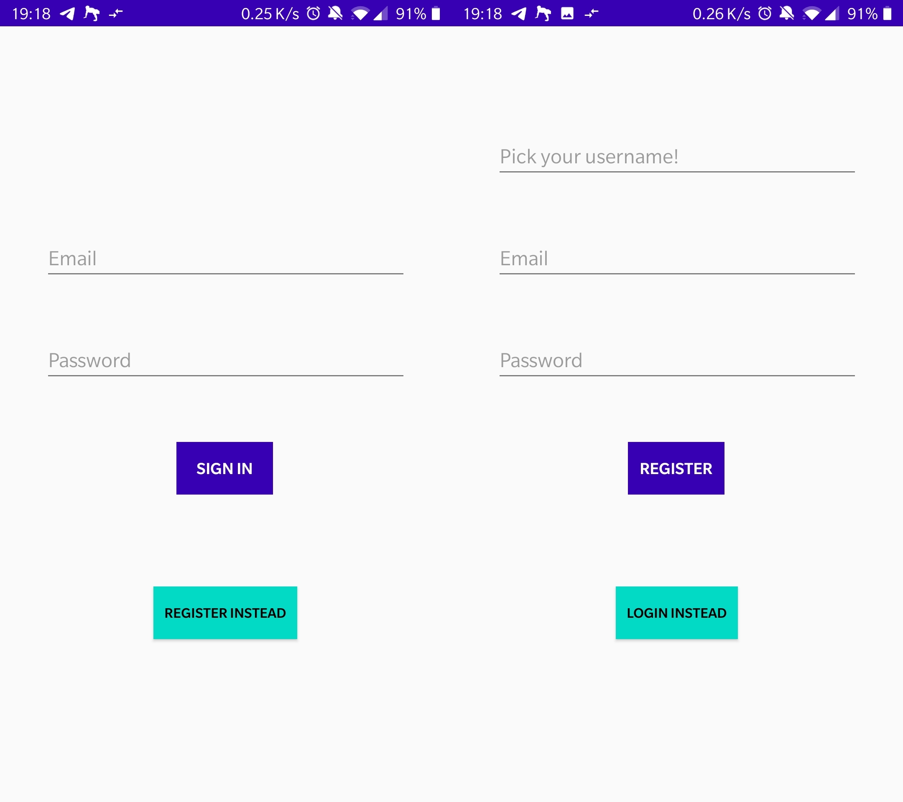
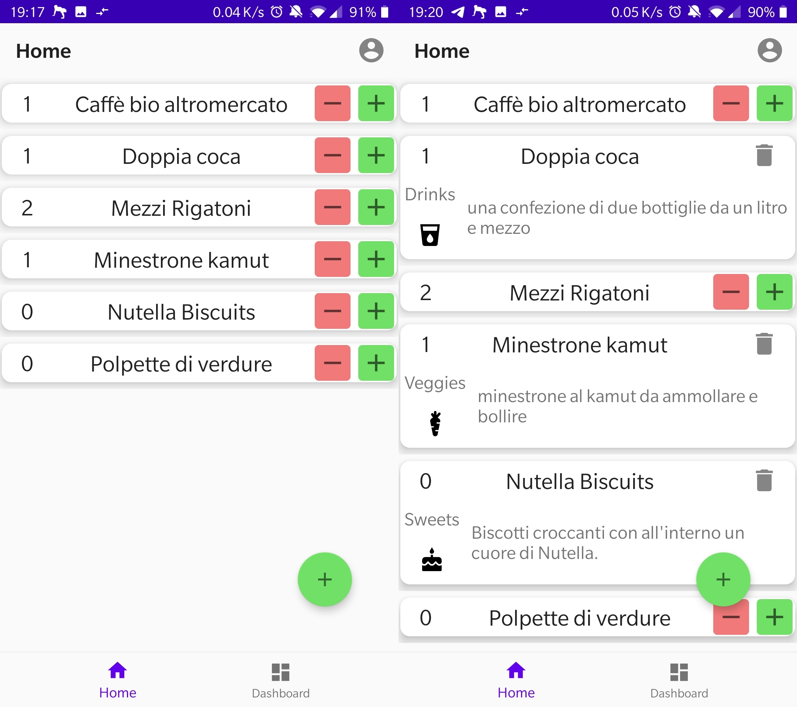
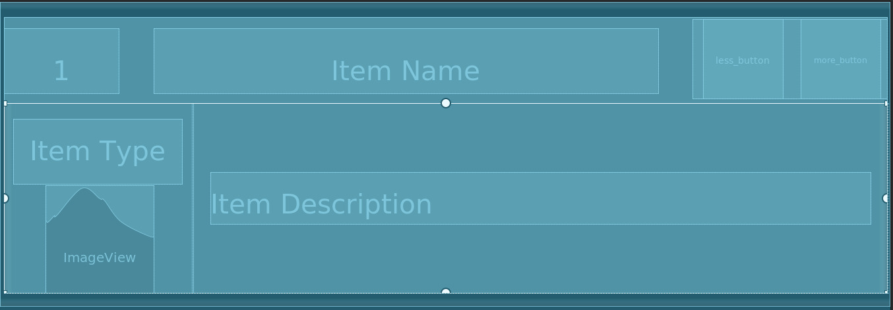
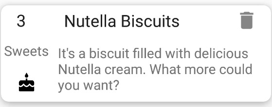
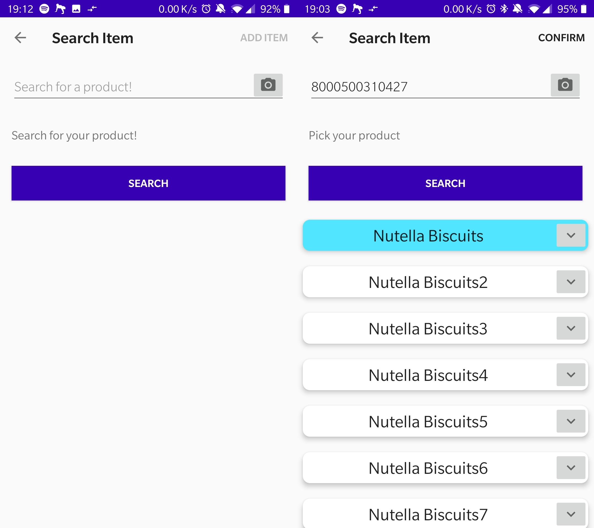
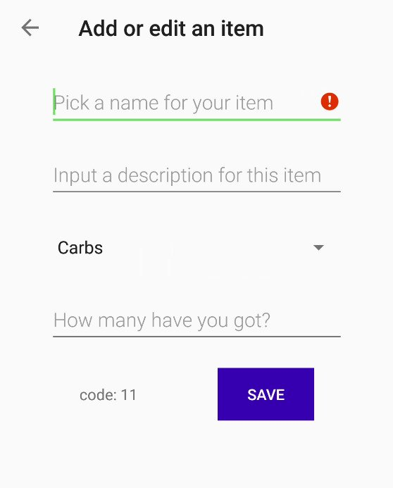
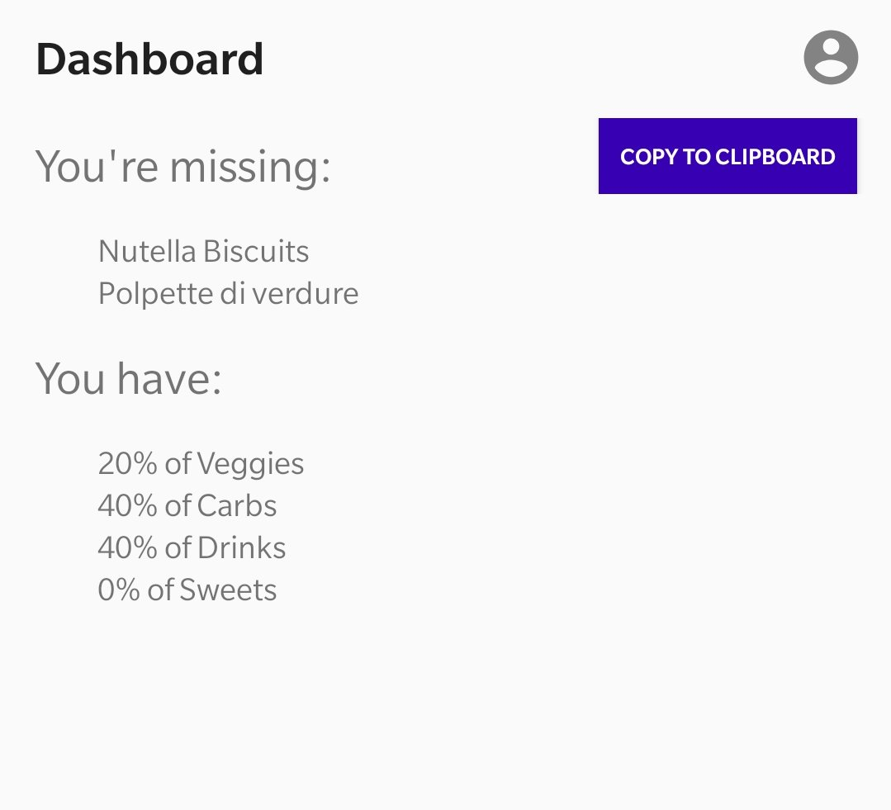

# Track my pantry
## or alternatively: Groceries!

Mobile Apps 2021 project

---
<!-- _class: invert -->
# Project requirements
Partly lifted from the original requirement document:
- Update the barcode knowledge base
- Login and register to access the remote database
- Keep track of the groceries bought

---
<!-- _class: invert -->
## Additional Features overview
- **Amounts**: in order to track groceries it must be possible to track how many instances of every product are in your pantry
- **Offline First**: manually add items
- **Product types**: types organized _functionally_
- **Barcode Scanning**

---
<!-- _class: invert -->
- **Dashboard**:
    - Missing Items: used as a grocery list
    - Product Percentage: simple overview, "wake-up call"
- **Login management**: authentication token saved in private storage, only prompt for login when necessary.

---
<!-- _class: invert -->
## Choice rationale
- **Learning opportunity**: Kotlin, modern solutions
- **Complete user experience**: include small, targeted improvements
- **Avoid excessive coding burden**: have simple and easily adaptable defaults

---

## Login
- Dynamic design
- Simple layout

---
<!-- _class: invert -->
## Login implementation
- Complete architecture:
    - ViewModel with LiveData (partially accessible)
    - Repository
    - Data Source kept separate
- Coroutine utilized:
    - `MainScope()` because login is synchronous

---

## Item List
- Items are collapsable
- Direct access to often-used functions
- Persistent

---
<!-- _class: invert -->
## Item List Implementation
- ViewModel shared with MainActivity
- RecyclerView avoids performance issues
- ViewModel, Repository and Database
- Room as a SQLite intermediary
- Non-blocking: queries executed on background "thread" (coroutines were used)

---

## Item
- Collapsable items
- Quick actions on the collapsed item
- Small icon
- Actions implemented in Adapter

---

## Item handling: Fetching and Browsing
- Fetching while logged in
- Require code to manually add new item
- Simple feedback text

---

## Item handling: Manual entry and edit
- Lax requirements
- Code is non-editable
- Type is a Spinner

---

## Dashboard
- **Missing items**:
    - Items that have amount = 0
    - Clipboard export
- **Percentage**:
    - Quick overview of groceries
    - May help with organization

---
<!-- _class: invert -->
# Thanks!